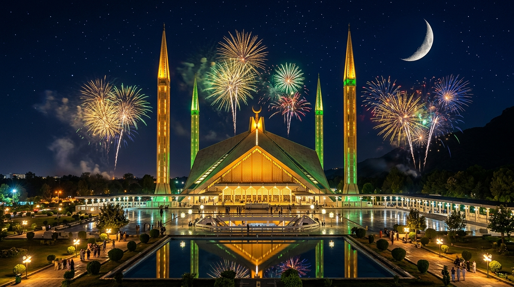

# 🇵🇰 Pakistan Zindabad — 14 August 1947
### Independence Day Celebration Front Page

A visually stunning, highly attractive, and fully responsive Independence Day celebration web application commemorating the historic birth of Pakistan on **14 August 1947**.



---

## 🌟 Key Highlights & Features

- 🇵🇰 **3D Animated Waving Pakistan Flag**: Realistic CSS 3D flag with dynamic cloth ripples, hoist white stripe, green field, golden finial, and glowing crescent & star.
- 🎆 **Interactive Canvas Fireworks & Star Particles**: 60fps canvas engine generating floating glowing embers, realistic firework bursts, and interactive click-to-explode fireworks.
- ⏳ **Real-Time Countdown Timer**: Live JavaScript countdown to upcoming August 14th with animated SVG circular progress rings and glowing glassmorphism cards.
- 🤝 **"Our Pride • Our Pakistan" (6 Feature Cards)**: Glassmorphism cards with 3D interactive mouse tilt physics showcasing Freedom, Unity, Faith, People, Peace, and Progress.
- 📜 **Historical Timeline & Quaid-e-Azam Tribute**: The momentous story of 14 August 1947, Lahore Resolution (1940), First Constitution (1956), 1973 Constitution, and verified Quaid-e-Azam quotes (*"Faith, Unity, Discipline"*).
- 🏛️ **National Landmarks Showcase**: Faisal Mosque, Minar-e-Pakistan, Badshahi Mosque, Pakistan Monument, and Mazar-e-Quaid.
- 📸 **"Colors of Pakistan" Gallery with Lightbox**: Category filter tabs (*All, Landmarks, Celebrations, Heritage*) and full Vanilla JS Lightbox modal with zoom, captions, and keyboard navigation.
- ✍️ **Voices of Patriotism (Live Pledge Wall)**: Interactive form allowing visitors to post their personal wishes and pledges with local storage persistence.
- 🎊 **Special "Crazy" Celebration Interaction**: Blasts a multi-colored fireworks barrage, 3D confetti storm with miniature Pakistan flags, and synthesized fanfare sound (via Web Audio API) with a grand celebration overlay: **"🇵🇰 HAPPY INDEPENDENCE DAY! — PAKISTAN ZINDABAD!"**.

---

## 🛠️ Technology Stack

- **HTML5**: Semantic, accessible markup.
- **CSS3**: Vanilla CSS with modern Glassmorphism, 3D transforms, fluid typography (`clamp()`), and responsive design.
- **Vanilla JavaScript**: Pure ES6+ without frameworks or external runtime dependencies.
- **Web Audio API**: Built-in audio synthesis for celebratory fanfare and firework sound effects.
- **Google Fonts**: *Montserrat*, *Cinzel*, *Great Vibes*, *Playfair Display*, *Poppins*, and *Inter*.

---

## 📁 Project Structure

```
INDEPENDENCE DAY/
├── index.html                   # Main HTML5 celebration portal
├── README.md                    # Project documentation
├── .gitignore                   # Git ignore file
├── css/
│   └── style.css                # Master CSS3 stylesheet
├── js/
│   └── script.js                # Fireworks, countdown, particles, lightbox & audio FX
└── assets/
    ├── icons/
    │   ├── crescent-star.svg    # Crescent & star vector
    │   ├── islamic-pattern.svg  # Geometric background pattern
    │   └── pakistan-flag.svg    # Official 3:2 flag vector
    └── images/
        ├── badshahi-mosque.jpg  # Badshahi Mosque night lighting
        ├── faisal-mosque.jpg    # Faisal Mosque under fireworks
        ├── mazar-e-quaid.jpg    # Mazar-e-Quaid white marble mausoleum
        ├── minar-e-pakistan.jpg # Minar-e-Pakistan illuminated
        ├── pakistan-monument.jpg# Pakistan Monument at dusk
        └── quaid-e-azam.jpg     # Quaid-e-Azam Muhammad Ali Jinnah
```

---

## 🚀 How to Run Locally

1. Clone or download this repository:
   ```bash
   git clone https://github.com/Muneeba-12/Independence-day.git
   ```
2. Open `index.html` in any web browser directly, or serve locally:
   ```bash
   python -m http.server 8080
   ```
3. Visit `http://localhost:8080` in your browser.

---

## 📄 License

Made with ❤️ for **Pakistan** 🇵🇰. Free to use for educational and celebration purposes.
